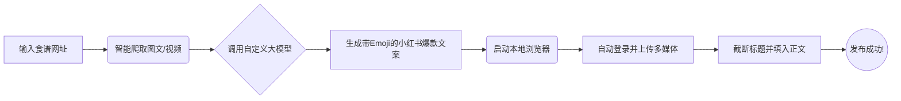

# 🍠 Xiaohongshu Recipe MCP (小红书爆款食谱全自动生成与发布工具)

[](https://www.python.org/downloads/)
[](https://modelcontextprotocol.io/)

这是一个基于 **MCP (Model Context Protocol)** 架构的自动化工具。只需给它一个任意的网页食谱 URL，它就能全自动完成：网页核心内容提取、配图下载、调用大模型生成带 Emoji 的小红书爆款风格文案，并在本地唤起浏览器实现全自动防风控免扫码上传与发布。

## ✨ 核心亮点 (Features)

- 🤖 **MCP 协议支持**：完美集成到 Claude, Cursor, OpenCode 等支持 MCP 的 AI 助手客户端中，一句话唤醒全自动工作流。
- 🕸️ **智能信息提取**：智能过滤无关网页推荐与广告，精准锁定食谱正文、配料表和高清大图。
- 🎬 **多媒体通吃**：支持自动解析并下载网页附带的高清视频（基于 `yt-dlp`，支持各大主流网站）。
- ✍️ **AI 爆款写手**：自动将任何语言的食谱转化为带有网感、具备极强实操性、富有故事性和 HashTag 的 800 字以内小红书专属文案，并确保标题永远不会触发长度超限。
- 🛡️ **最强防风控发布**：抛弃极易被封号和验证拦截的 API 请求，采用基于 Playwright 的纯物理UI模拟点击操作。一键保存登录凭证，实现长效免扫码。

## 🆕 最新更新 (Recent Updates)

- 📹 **视频笔记全自动发布**：新增对网页视频及封面图的智能提取与全自动上传支持。
- 📸 **截屏排查保障**：现在会在发布操作前、成功后或发生错误时自动保存页面截图，极大地提升稳定性及问题排查效率！
- 🛡️ **底层架构升级**：彻底移除第三方 API 依赖，全面拥抱基于 Playwright 的纯粹"物理页面点击"方案，将封号风险降至极低！
- 📝 **支持"暂存草稿"新特性**：发布不再一锤定音！支持生成笔记后自动存入小红书草稿箱，给你充足的人工微调空间！

## 🪄 提供的工具与触发提示词 (Prompt Examples)

本 MCP Server 对 AI 助理（如 Cursor, OpenCode 等）暴露了 3 个核心能力，你可以通过类似下面的自然语言让 AI 直接触发：

### 1. 自动生成并存入草稿箱 (推荐)
- **工具名称**: `generate_and_save_draft_recipe`
- **能力描述**: 抓取图文并生成完美文案，然后**自动填入小红书，但不点击发布，而是点击“暂存草稿”！**
- **提示词示例**: 
  > *"帮我把这篇食谱抓下来，写好文案存到小红书草稿箱里等我修改：https://xxxx..."*

### 2. 全自动一键发布
- **工具名称**: `generate_and_publish_recipe`
- **能力描述**: 抓取图文并生成文案，执行全自动上传，并在填完内容后**直接点击发布**。
- **提示词示例**: 
  > *"直接把这个食谱发到我的小红书上：https://xxx..."*

### 3. 本地生成笔记草稿 (不弹起浏览器)
- **工具名称**: `draft_recipe_note`
- **能力描述**: 仅提取图文并使用 AI 生成排版好的小红书爆款文案，通过 Markdown 文字返回给你，**不唤起浏览器进行任何操作**。
- **提示词示例**: 
  > *"帮我读一下这个网页的食谱，写一篇小红书文案给我看看，暂时不要去发布：https://xxxx..."*

## 🚀 工作流程展示



## 🛠️ 安装指南 (Installation)

### 1. 克隆项目与安装依赖
```bash
git clone https://github.com/big-dollar/xiaohongshu-recipe-mcp.git
cd xiaohongshu-recipe-mcp

# 推荐使用虚拟环境
python -m venv venv
source venv/bin/activate  # Windows: venv\Scripts\activate

# 安装 Python 依赖
pip install -r requirements.txt

# 安装 Playwright 所需的浏览器内核
playwright install chromium
```

### 2. 配置环境变量
复制模板文件并填入你的大模型 API 配置（支持 OpenAI 或任何与之兼容的第三方 API 平台，如 DeepSeek、硅基流动等）：

```bash
cp .env.example .env
```
修改 `.env` 文件：
```ini
OPENAI_API_KEY=your_openai_api_key_here
OPENAI_BASE_URL=https://api.openai.com/v1
MODEL_NAME=gpt-4o-mini
```

## 🔌 配置 MCP 客户端 (集成到 AI 助手)

### 在 OpenCode 中配置
打开或创建 `~/.config/opencode/opencode.json`，在 `mcp` 节点下增加配置：

```json
{
  "mcp": {
    "xiaohongshu-recipe": {
      "type": "local",
      "command": [
        "python",
        "你的绝对路径/xiaohongshu-recipe-mcp/server.py"
      ],
      "enabled": true,
      "environment": {
        "PYTHONPATH": "你的绝对路径/xiaohongshu-recipe-mcp"
      }
    }
  }
}
```
*配置完成后，重启 AI 助手即可在聊天框直接对 AI 说：“把这个网页食谱发到小红书：https://xxxx...”*

## 🎮 手动测试运行

如果你不想走 MCP 客户端，想直接测试核心流程，可以通过命令行强制执行内部逻辑：
```bash
python server.py "https://recipe30.com/cinderella-potatoes.html/"
```

> **首次运行提示：** 
> 第一次执行发布流程时，你的桌面上会弹出一个真实的 Chrome 浏览器。当它停在登录页时，**请在 120 秒内使用手机小红书 App 扫码登录**。一旦登录成功，它会自动保存 Cookie，此后的所有发布都将是全自动的无人值守操作。

## ⚠️ 免责声明 (Disclaimer)

本项目仅供自动化学习、AI 提示词工程研究与个人日常内容整理使用。请勿用于高频恶意群发、营销号霸屏等违反《小红书社区规范》的行为。因滥用此工具造成的账号异常由使用者自行承担。

## 📄 License
MIT License